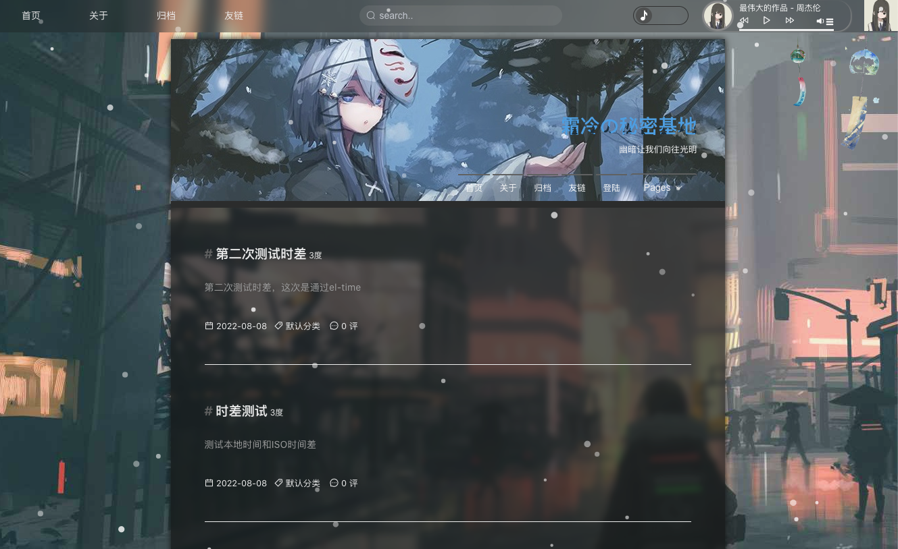
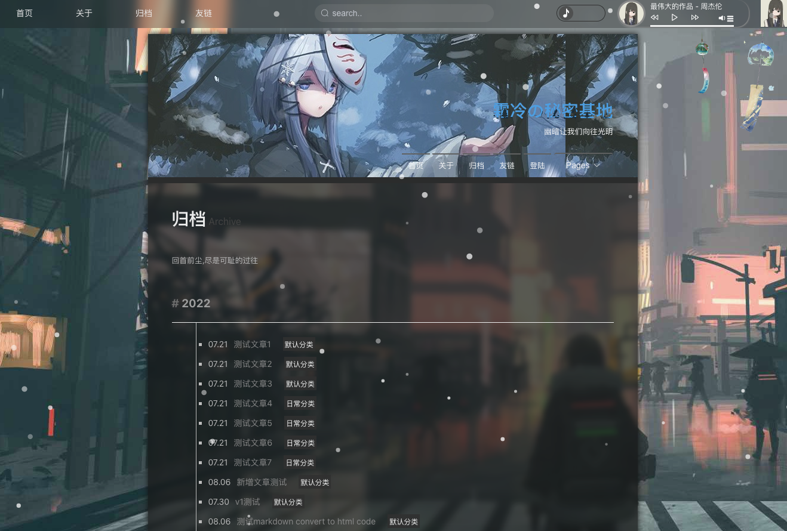
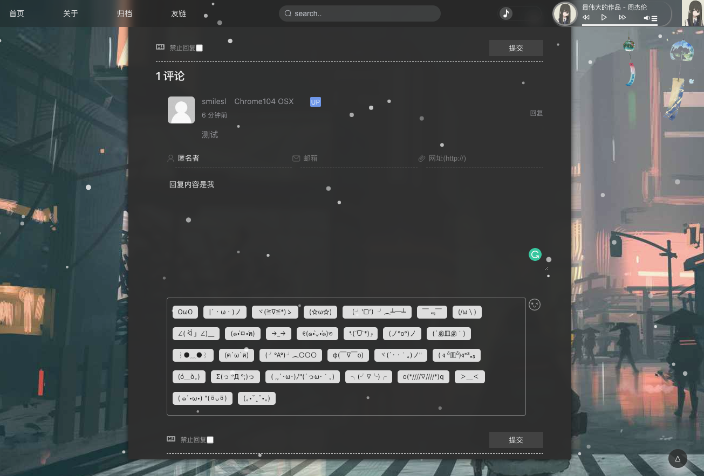
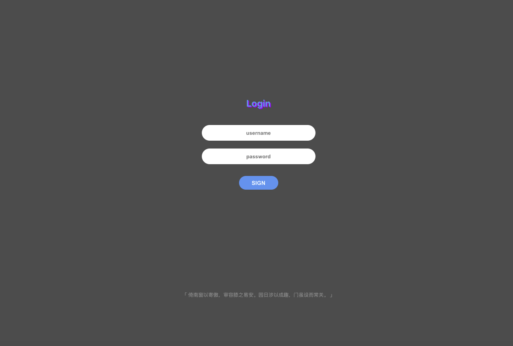
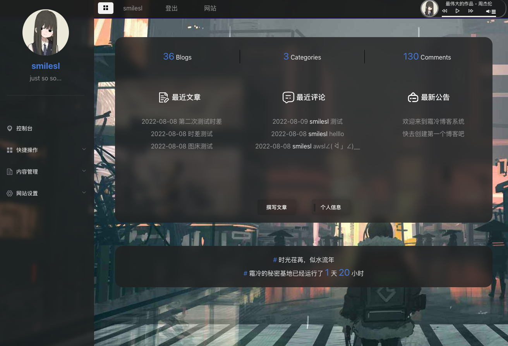
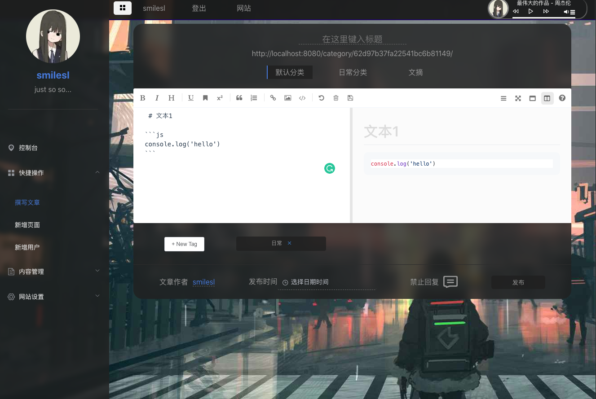
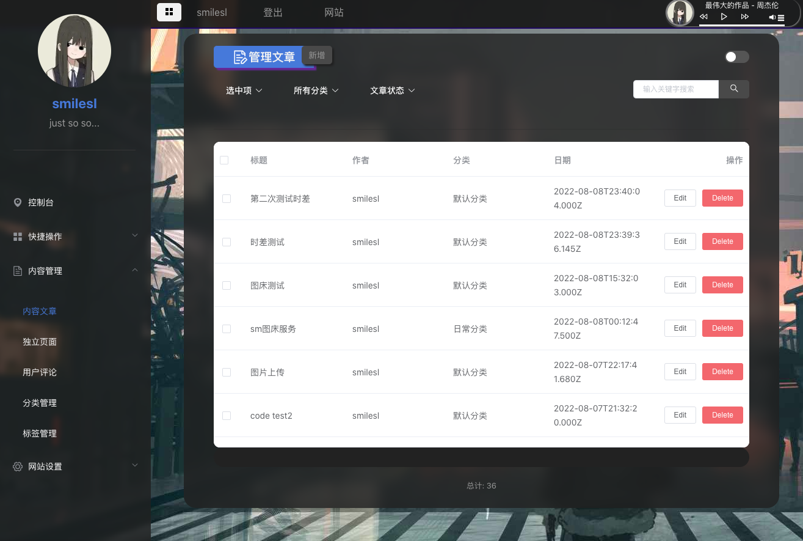

# 霜冷的秘密基地 - 博客系统


主要使用vue2脚手架 + elementUI搭建前端部分，具体版本可见`package.json`文件，下面是一些展示图，后台部分管理功能正在开发




















## Project setup

```
yarn install
```

### Compiles and hot-reloads for development
```
yarn serve
```

### Compiles and minifies for production
```
yarn build
```

### Lints and fixes files
```
yarn lint
```


### Customize configuration
See [Configuration Reference](https://cli.vuejs.org/config/).
